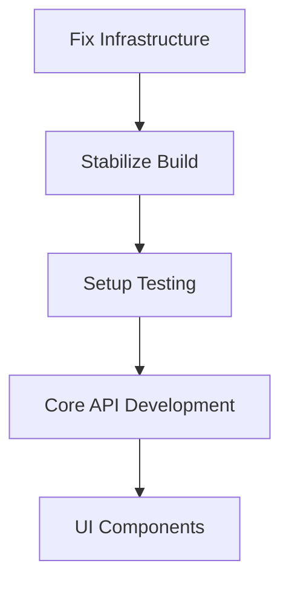
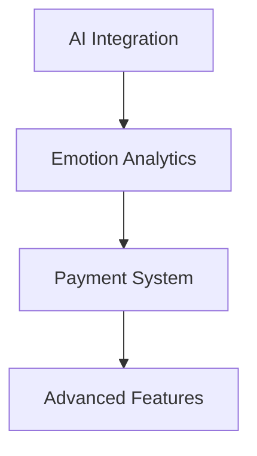
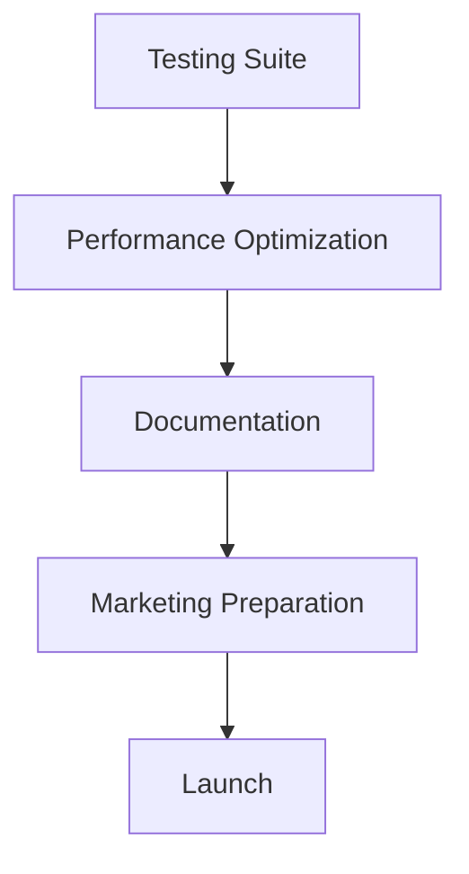

# BMAD Framework - NEXUS.SALES Implementation

## Agent Roles and Responsibilities

### 🏗️ **Архитектор**
**Задачи:**
- Проектирование системной архитектуры
- Выбор технологических решений
- Определение интеграционных паттернов
- Планирование масштабируемости

**Ожидаемые результаты:**
- Архитектурная диаграмма системы
- Техническое ТЗ на компоненты
- Стандарты разработки
- Performance benchmarks

### 📊 **Аналитик**
**Задачи:**
- Анализ бизнес-требований
- Проектирование пользовательских историй
- Валидация функциональности
- Анализ конкурентов и рынка

**Ожидаемые результаты:**
- User Stories с acceptance criteria
- Product backlog с приоритизацией
- Функциональные требования
- Metrics и KPI definition

### 💻 **Разработчик**
**Задачи:**
- Реализация кода согласно архитектуре
- Code review и рефакторинг
- Интеграция компонентов
- Исправление багов

**Ожидаемые результаты:**
- Working code с unit tests
- Документация API
- Готовые к деплою features
- Code coverage > 80%

### 🧪 **Тестировщик**
**Задачи:**
- Планирование тестовых сценариев
- Автоматизация тестирования
- Regression testing
- Performance testing

**Ожидаемые результаты:**
- Test plans и test cases
- Автоматизированные тесты (e2e, unit)
- Bug reports с воспроизведением
- Quality gates для CI/CD

### 📝 **Документатор**
**Задачи:**
- Техническая документация
- User guides и tutorials
- API документация
- Release notes

**Ожидаемые результаты:**
- README и setup guides
- API documentation (OpenAPI)
- User onboarding materials
- Knowledge base

## Development Process Framework

### 🎯 **Sprint Goal Planning**
1. **Week-1 Goal**: Infrastructure Stabilization
   - Fix OneDrive issues, setup CI/CD
   - Stabilize build process
   - Setup testing framework

2. **Week-2 Goal**: Core Functionality
   - Complete Auth/Products API
   - Implement funnel builder
   - Fix UI/UX issues

3. **Week-3 Goal**: AI Integration
   - Emotion analytics implementation
   - AI-powered recommendations
   - Real-time data processing

4. **Week-4 Goal**: Payment & Features
   - Stripe integration
   - Email automation
   - Advanced funnel features

5. **Week-5 Goal**: Testing & Polish
   - E2E testing suite
   - Performance optimization
   - Security audit

6. **Week-6 Goal**: Launch Preparation
   - Final testing
   - Documentation completion
   - Marketing materials

### 📋 **Task Breakdown Structure**

#### **Infrastructure (Архитектор + DevOps)**
```javascript
// CI/CD Pipeline
const cicd = {
  stages: ['lint', 'typecheck', 'test', 'build', 'deploy'],
  environment: 'docker-compose',
  monitoring: 'health-checks'
}
```

#### **Backend API (Разработчик + Архитектор)**
```clojure
;; API Structure
(def api-endpoints
  {:auth ["/login" "/register" "/refresh"]
   :products ["/products" "/products/:id"]
   :analytics ["/insights" "/emotions" "/journey"]
   :payments ["/checkout" "/webhooks"]})
```

#### **Frontend Components (Разработчик + Аналитик)**
```typescript
// Component Architecture
interface FunnelBuilder {
  canvas: DragDropCanvas;
  elements: FunnelElement[];
  preview: MobileResponsive;
  ai: EmotionAnalytics;
}
```

#### **Testing Suite (Тестировщик)**
```javascript
// Test Coverage
const testSuite = {
  unit: ['components', 'utils', 'api'],
  integration: ['auth-flow', 'payment-flow'],
  e2e: ['user-journey', 'funnel-creation'],
  performance: ['load-testing', 'memory-usage']
}
```

## Agile Principles Implementation

### 🔄 **Iterative Development**
- Weekly sprints with demo sessions
- Continuous integration/deployment
- Feature flags for gradual rollout
- Regular retrospectives

### 📈 **Feedback Loops**
- Daily standups (async in Slack)
- Weekly demos to stakeholders
- User feedback integration
- Metrics-driven decisions

### 🎯 **Adaptive Planning**
- Backlog refinement sessions
- Priority adjustments based on feedback
- Risk assessment and mitigation
- Scope flexibility

## Sprint Metrics and KPIs

### 📊 **Development Metrics**
```typescript
interface SprintMetrics {
  velocity: number; // Story points completed
  burndown: number[]; // Daily progress
  codeQuality: {
    coverage: number;
    bugs: number;
    techDebt: number;
  };
  deployment: {
    frequency: number;
    successRate: number;
    rollbackRate: number;
  };
}
```

### 🎯 **Business Metrics**
```typescript
interface BusinessKPIs {
  userAcquisition: number; // New signups
  activation: number; // First funnel created
  retention: number; // Weekly active users
  revenue: number; // Conversion to paid
  satisfaction: number; // NPS score
}
```

## Risk Management

### ⚠️ **Technical Risks**
| Risk | Probability | Impact | Mitigation |
|------|-------------|--------|------------|
| OneDrive build issues | High | High | Immediate repo migration |
| Hugging Face limits | Medium | High | Caching + fallback models |
| Type errors | High | Medium | Strict TypeScript setup |
| Performance issues | Medium | Medium | Load testing + optimization |

### 📈 **Business Risks**
| Risk | Probability | Impact | Mitigation |
|------|-------------|--------|------------|
| User adoption | Medium | High | UX research + iterations |
| Competition | Low | Medium | Unique AI features |
| Technical debt | High | Medium | Regular refactoring sprints |
| Security vulnerabilities | Low | High | Security audits + penetration testing |

## Implementation Roadmap

### 🚀 **Phase 1: Foundation (Weeks 1-2)**


### 🧠 **Phase 2: Intelligence (Weeks 3-4)**


### 🎯 **Phase 3: Launch (Weeks 5-6)**


## Success Criteria

### ✅ **Technical Success**
- Build success rate > 95%
- Test coverage > 80%
- Page load time < 2s
- Zero critical security vulnerabilities

### 📊 **Business Success**
- 100+ pilot users in 30 days
- 60%+ create first funnel in 14 days
- 15%+ convert to paid in 45 days
- Average time to first sale < 10 minutes

### 🎯 **Quality Success**
- User satisfaction score > 4.5/5
- Bug report rate < 5 per 100 users
- Feature adoption rate > 70%
- Support ticket resolution < 24h

---

*BMAD Framework ensures systematic, measurable, and adaptive development process for NEXUS.SALES platform success.*