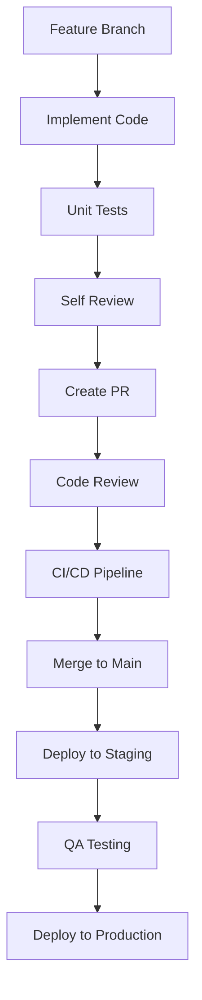

# BMAD Development Process - NEXUS.SALES

## Process Flow Implementation

### 🔄 **1. Сбор требований**

#### **Архитектор + Аналитик**
```typescript
interface RequirementGathering {
  stakeholderInterviews: StakeholderInput[];
  competitorAnalysis: CompetitorFeature[];
  technicalConstraints: TechnicalLimit[];
  businessGoals: BusinessObjective[];
}

// Implementation
const gatherRequirements = async () => {
  const userStories = await analyzeUserNeeds();
  const technicalSpecs = await defineArchitecture();
  const businessMetrics = await setupKPIs();

  return {
    functionalRequirements: userStories,
    nonFunctionalRequirements: technicalSpecs,
    successCriteria: businessMetrics
  };
};
```

#### **Deliverables:**
- Product Requirements Document (PRD)
- Technical Requirements Specification (TRS)
- User Journey Maps
- Acceptance Criteria Definition

---

### 🏗️ **2. Проектирование архитектуры**

#### **Архитектор + Разработчик**
```typescript
interface ArchitectureDesign {
  systemArchitecture: ComponentDiagram;
  dataFlow: DataFlowDiagram;
  apiSpecification: OpenAPISpec;
  deploymentStrategy: DeploymentPlan;
}

// NEXUS.SALES Architecture
const systemDesign = {
  frontend: {
    framework: 'Next.js 15',
    stateManagement: 'React Context + Zustand',
    styling: 'Tailwind CSS + Shadcn/ui',
    testing: 'Jest + Playwright'
  },
  backend: {
    api: 'Clojure + Ring',
    database: 'PostgreSQL + Datomic',
    ai: 'Hugging Face + OpenAI',
    payments: 'Stripe API'
  },
  infrastructure: {
    deployment: 'Vercel + Railway',
    monitoring: 'Sentry + Analytics',
    ci_cd: 'GitHub Actions'
  }
};
```

#### **Deliverables:**
- System Architecture Diagram
- Database Schema Design
- API Documentation (OpenAPI)
- Deployment Architecture

---

### 💻 **3. Реализация кода**

#### **Разработчик + Тестировщик**
```typescript
interface CodeImplementation {
  developmentStandards: CodingStandard[];
  codeReviewProcess: ReviewProcess;
  testingStrategy: TestStrategy;
  qualityGates: QualityMetric[];
}

// Implementation Standards
const codingStandards = {
  typescript: {
    strict: true,
    noImplicitAny: true,
    exactOptionalPropertyTypes: true
  },
  eslint: 'airbnb-typescript',
  prettier: 'standard-config',
  commitLint: 'conventional-commits'
};

// Code Review Checklist
const reviewChecklist = [
  'Business logic correctness',
  'Type safety compliance',
  'Unit test coverage',
  'Performance considerations',
  'Security vulnerability check',
  'Code maintainability'
];
```

#### **Development Workflow:**


#### **Deliverables:**
- Working Features with Tests
- Code Documentation
- PR Reviews and Approvals
- Deployment Packages

---

### 🧪 **4. Тестирование**

#### **Тестировщик + Разработчик**
```typescript
interface TestingStrategy {
  unitTesting: UnitTestSuite;
  integrationTesting: IntegrationTestSuite;
  e2eTesting: E2ETestSuite;
  performanceTesting: PerformanceTestSuite;
}

// Testing Implementation
const testingSuite = {
  unit: {
    framework: 'Jest + Testing Library',
    coverage: '>= 80%',
    files: '**/*.test.{ts,tsx}'
  },
  integration: {
    framework: 'Jest + Supertest',
    scope: 'API endpoints + DB interactions',
    environment: 'test-db'
  },
  e2e: {
    framework: 'Playwright',
    scenarios: 'Critical user journeys',
    browsers: ['chrome', 'firefox', 'safari']
  },
  performance: {
    tools: 'Lighthouse + K6',
    metrics: ['LCP', 'FID', 'CLS', 'TTFB'],
    targets: 'LCP < 2.5s, FID < 100ms'
  }
};
```

#### **Test Automation Pipeline:**
```typescript
// Automated Testing Flow
const testPipeline = {
  preCommit: ['lint', 'typecheck', 'unit-tests'],
  onPR: ['integration-tests', 'security-scan'],
  onMerge: ['e2e-tests', 'performance-tests'],
  onDeploy: ['smoke-tests', 'health-checks']
};
```

#### **Deliverables:**
- Test Plans and Test Cases
- Automated Test Suites
- Bug Reports with Reproduction Steps
- Performance and Security Reports

---

### 📖 **5. Документация и релиз**

#### **Документатор + Аналитик**
```typescript
interface DocumentationStrategy {
  technicalDocs: TechnicalDocumentation;
  userDocs: UserDocumentation;
  apiDocs: APIDocumentation;
  releaseNotes: ReleaseNotes;
}

// Documentation Structure
const docsStructure = {
  technical: {
    architecture: 'ARCHITECTURE.md',
    setup: 'README.md',
    contributing: 'CONTRIBUTING.md',
    deployment: 'DEPLOYMENT.md'
  },
  user: {
    gettingStarted: 'GETTING_STARTED.md',
    tutorials: 'docs/tutorials/',
    faq: 'FAQ.md',
    troubleshooting: 'TROUBLESHOOTING.md'
  },
  api: {
    openapi: 'api-spec.yaml',
    postman: 'postman-collection.json',
    examples: 'examples/'
  }
};
```

#### **Release Process:**
```typescript
const releaseProcess = {
  preparation: [
    'Feature freeze',
    'Final testing',
    'Documentation update',
    'Performance validation'
  ],
  deployment: [
    'Staging deployment',
    'Smoke testing',
    'Production deployment',
    'Health monitoring'
  ],
  postRelease: [
    'Metrics monitoring',
    'User feedback collection',
    'Bug triage',
    'Retrospective meeting'
  ]
};
```

#### **Deliverables:**
- Complete Technical Documentation
- User Guides and Tutorials
- API Documentation
- Release Notes and Migration Guides

---

## Agile Implementation

### 🎯 **Sprint Structure (1 Week Iterations)**

```typescript
interface SprintStructure {
  planning: SprintPlanningSession;
  dailyStandups: DailyStandup[];
  review: SprintReview;
  retrospective: SprintRetrospective;
}

// Weekly Sprint Cycle
const sprintCycle = {
  monday: {
    event: 'Sprint Planning',
    duration: '2 hours',
    participants: 'Full team',
    outcome: 'Sprint backlog + commitments'
  },
  daily: {
    event: 'Daily Standup',
    duration: '15 minutes',
    format: 'Async in Slack',
    updates: ['yesterday', 'today', 'blockers']
  },
  friday: {
    events: ['Sprint Review', 'Sprint Retrospective'],
    duration: '1 hour each',
    outcomes: ['Demo + feedback', 'Process improvements']
  }
};
```

### 📊 **Feedback Loops**

```typescript
const feedbackMechanisms = {
  technical: {
    codeReview: 'Every PR',
    pairProgramming: 'Complex features',
    techTalks: 'Weekly knowledge sharing'
  },
  product: {
    userTesting: 'Weekly with 5 users',
    stakeholderDemo: 'Sprint review',
    metricsReview: 'Daily dashboard check'
  },
  process: {
    retrospectives: 'Weekly',
    processMetrics: 'Velocity, quality, satisfaction',
    continuousImprovement: 'Action items tracking'
  }
};
```

### 🔄 **Adaptive Planning**

```typescript
const adaptivePlanning = {
  backlogRefinement: {
    frequency: 'Continuous',
    participants: 'Product owner + team',
    activities: ['Story breakdown', 'Estimation', 'Prioritization']
  },
  riskManagement: {
    identification: 'Weekly risk assessment',
    mitigation: 'Proactive planning',
    monitoring: 'Risk dashboard'
  },
  scopeAdjustment: {
    triggers: ['New requirements', 'Technical constraints', 'Timeline pressure'],
    process: ['Impact assessment', 'Stakeholder alignment', 'Plan update']
  }
};
```

---

## Quality Assurance

### ✅ **Definition of Done**

```typescript
const definitionOfDone = {
  feature: [
    'Acceptance criteria met',
    'Unit tests written and passing',
    'Integration tests passing',
    'Code reviewed and approved',
    'Documentation updated',
    'Security reviewed',
    'Performance validated'
  ],
  sprint: [
    'All committed features done',
    'No critical bugs',
    'Demo prepared',
    'Metrics reviewed',
    'Retrospective completed'
  ],
  release: [
    'All features tested end-to-end',
    'Performance benchmarks met',
    'Security audit passed',
    'Documentation complete',
    'Deployment plan validated',
    'Rollback plan ready'
  ]
};
```

### 📈 **Continuous Improvement**

```typescript
const continuousImprovement = {
  metrics: {
    velocity: 'Story points per sprint',
    quality: 'Bug rate, test coverage',
    satisfaction: 'Team NPS, user feedback',
    performance: 'Build time, deployment frequency'
  },
  experiments: {
    process: 'A/B test new practices',
    technical: 'Proof of concepts',
    product: 'Feature flags and gradual rollout'
  },
  learning: {
    techTalks: 'Weekly knowledge sharing',
    training: 'Online courses and conferences',
    mentoring: 'Pair programming and code review'
  }
};
```

---

*BMAD Process ensures systematic, iterative, and high-quality development workflow for NEXUS.SALES platform.*